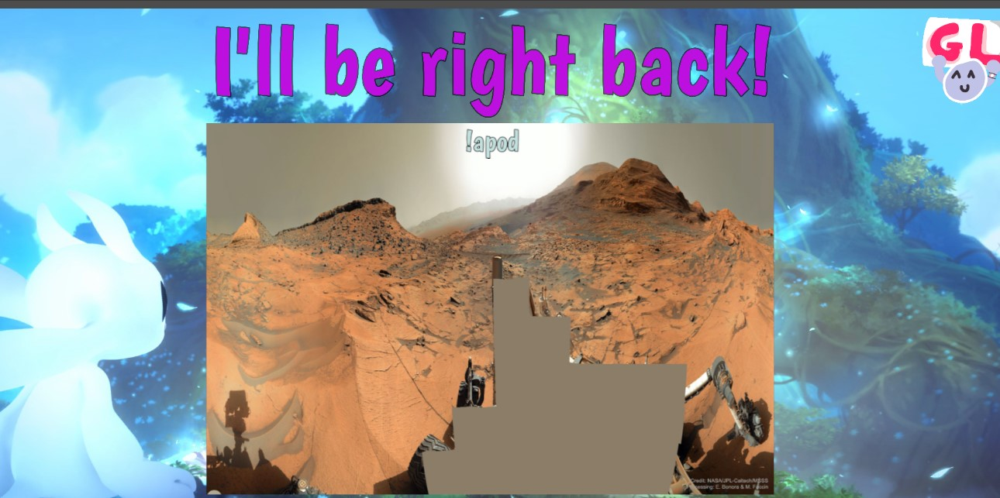

# OBS APOD

Astronomical Picture of the Day is a project by NASA to have cool astronomical pictures every day. https://apod.nasa.gov/apod/. This is a script that automaticaly gets the high res link for the image of the day and sets it to the link in the web source that you give it. **READ MORE IF YOU WANT TO KNOW HOW TO SET IT UP.**

Here is an example of how you could use it in a BRB screen:

## How to set it up
1. Download the apod.py file from this git.
2. Create a browser source and name it something like `APOD IMAGE`
3. Go to the scripts window in OBS.

4. Import the script that you downloaded.
5. In the settings window that opens, leave the **URL** and **RSS URL** as they are (currently no RRS features are being used). 
The **Refresh time** is how ever many minutes it checks to see if there is a new image. 10 minutes should be fine and if you really need to refresh the image, click the button named `Refresh` below. *Note: when you open OBS, the scripts will all automaticaly run and therefore refresh the image.* 
Set the **Browser Source** to the source that you had create before. The **text source** dosen't mean anything right now. Click the *refresh* button and if you set the correct source, you should now see the image.

6. Inside the properties of the source, set the **dimentions** to whatever you want, the image will scaled to fit in the bounds. Set the **Custom CSS** to `body { background: transparent !important; margin: 0px auto;}` to make sure that you don't have any black bars around the image.

7. You should be all set up! :)

If you have any questions, feel free to DM me on discord at SuperZooper#0003.